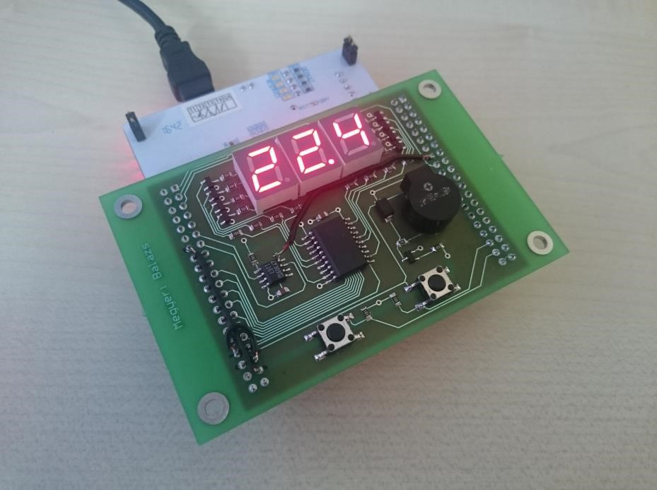
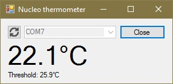

# USB-s szobahőmérő

Mikrokontroller laboratórium   
Házi feladat

## Feladatkiírás

Készítsen kiegészítő hardver egységet az STM32 NUCLEO-F446RE kithez, amely alkalmas hőmérséklet mérésére és a mért adatok továbbítására soros kommunikációval USB buszon. A feladat megoldásához egy SPI buszos hőmérő IC illesztése szükséges. A hőmérsékletet másodpercenként olvassa ki, majd továbbítsa a PC-nek. A soros kommunikációhoz virtuális soros portot használjon, melyet a kiten megtalálható USB port segítségével valósítson meg! Az aktuális hőmérsékletet 3 db hétszegmenses kijelzőn jelenítse meg. A kijelzők vezérlésére tetszőleges illesztési módot választhat (soros/párhuzamos/időmultiplexelt). Helyezzen el továbbá 2 nyomógombot is, valamint egy buzzert. A nyomógombok segítségével egy kritikus hőmérséklet legyen beállítható, amelyet elérve a felhasználót a buzzer segítségével hangjelzéssel figyelmezteti. Ne feledkezzen el a gombok (szoftveres) pergésmentesítéséről!

Az áramkör megtervezése, megépítése és üzembe helyezése után készítsen el egy, az eszköz bemutatására szolgáló demonstrációs célú tesztprogram rendszert, amely magában foglalja a megfelelő működést biztosító mikrokontrolleres programot, illetve egy PC-s kliensprogramot.
